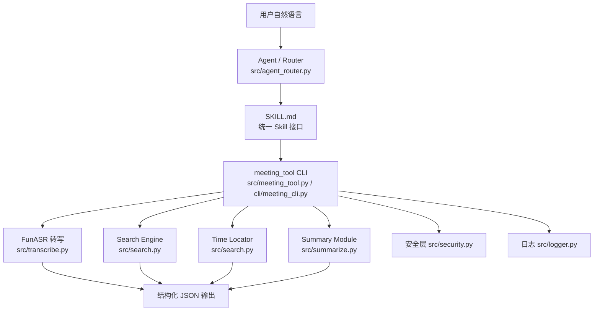

# 系统架构

## 总览

## 各层职责

### 1. 用户自然语言

用户输入如“搜索预算”“01:30 附近说了什么”“生成会议摘要”“帮我转写这段录音”。

### 2. Agent / Router（`src/agent_router.py`）

轻量规则式意图识别，把自然语言映射到四类意图：

- `transcribe`：转写 / 转录 / 识别 / ASR
- `search`：搜索 / 查询 / 查找 / 提到 / 提及
- `locate`：时间格式（`HH:MM`、`HH:MM:SS`）或“附近”“X 分钟到 Y 分钟”
- `summarize`：摘要 / 总结 / 概括 / 纪要

底层确定性工作（搜索、排序、时间解析）全部在 Python 内完成，不交给大模型。

### 3. SKILL.md（统一 Skill 接口）

定义 `name`、`description`、使用场景、输入参数、输出格式、CLI 命令、失败处理
与安全边界。Skill 调用真实 Script/CLI，而非 Prompt 模板。

### 4. meeting_tool CLI（`src/meeting_tool.py` / `cli/meeting_cli.py`）

可脱离 Agent 独立运行的统一入口，子命令 `transcribe` / `search` / `locate` /
`summarize` / `route`，成功退出码 0，失败非 0。

### 5. 能力模块

- FunASR 转写：`paraformer-zh` + `fsmn-vad` + `ct-punc`，输出带
  `start_ms` / `end_ms` / `text` 的片段。
- Search Engine：关键词命中 + 时间戳 + 前后上下文，仅返回命中片段。
- Time Locator：解析 `MM:SS` / `HH:MM:SS` / 秒，支持点定位与区间定位。
- Summary Module：抽取式 fallback + 可选外部 LLM，输出主题、概要、讨论点、
  决策、待办。

### 6. 安全层（`src/security.py`）与日志（`src/logger.py`）

文件白名单、防目录穿越、覆盖确认；JSONL 日志脱敏，不记录敏感凭据与音频内容。

### 7. 结构化输出

所有命令输出 JSON，便于 Agent Runtime 解析与下游展示。
